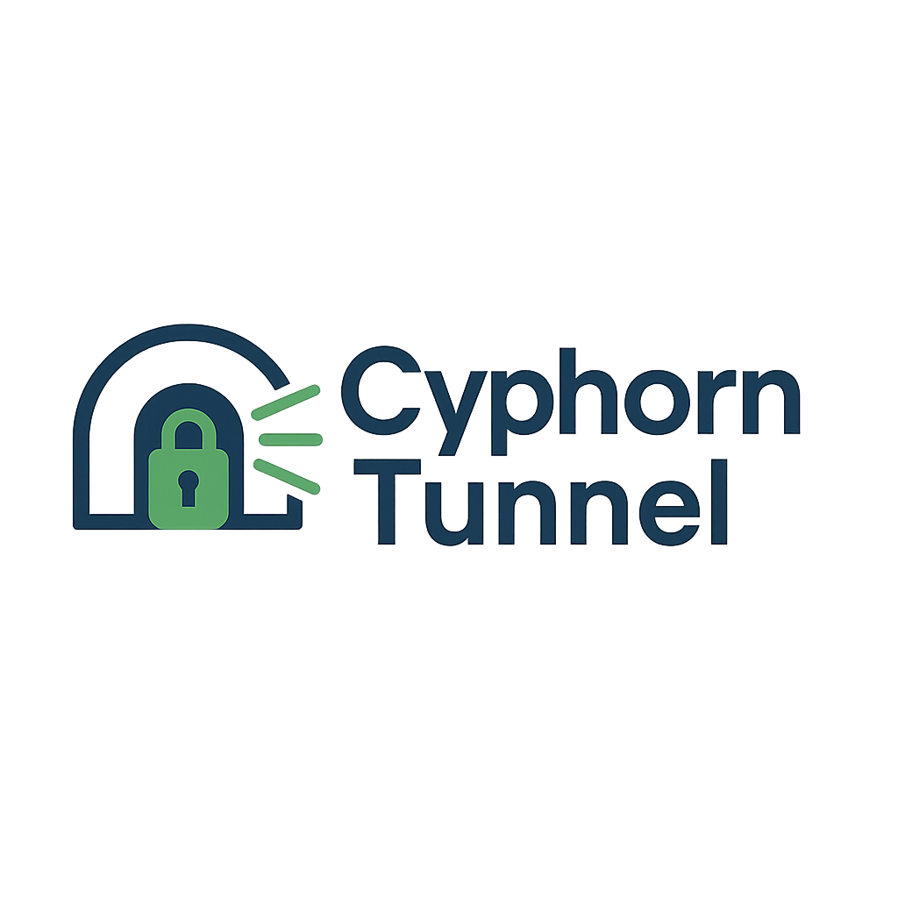

<p align="center">
  
</p>


# cyphorn_tunnel
Cyphorn Tunnel binary and manager script (proprietary)

Cyphorn Tunnel is a proprietary encrypted Layer-4 tunnel over UDP, developed by Mohammad Alhummada.

This repository contains only the binary and the manager script. The source code is not published.
Commercial use requires a paid license. For inquiries: cyphorntech@gmail.com

  --------------------------------------------------------------------------------------------------------------------------------------------------

## Why Cyphorn Tunnel?

Cyphorn Tunnel is designed to provide **secure and lightweight communication** over UDP.  
Unlike traditional VPNs, it focuses on simplicity and performance at the transport layer (Layer-4).  

### Key Benefits
- 🔒 **Strong encryption**: All traffic is secured with ChaCha20-Poly1305.  
- ⚡ **Lightweight**: Very low overhead compared to TLS-based tunnels or heavy VPNs.  
- 🔄 **Automatic reconnect**: Keeps the tunnel alive even on unstable networks.  
- 🌍 **Endpoint roaming**: Client can move between networks without breaking the tunnel.  
- 🛠️ **Simple management**: One unified script `cyphornctl.sh` for start, stop, restart, logs.  

---

## Cryptography

Cyphorn Tunnel uses **ChaCha20-Poly1305** as its authenticated encryption algorithm (AEAD).  

- Optimized for performance on all CPUs, even without hardware acceleration.  
- Provides confidentiality, integrity, and authenticity in one operation.  
- Trusted in modern protocols such as TLS 1.3 and WireGuard.  


## لماذا نفق سايفورن؟

صُمم نفق سايفورن لتوفير **اتصالات آمنة وخفيفة** عبر بروتوكول UDP.

على عكس شبكات VPN التقليدية، يُركز هذا النفق على البساطة والأداء في طبقة النقل (الطبقة الرابعة).

### المزايا الرئيسية
- 🔒 **تشفير قوي**: جميع حركات المرور مؤمنة باستخدام ChaCha20-Poly1305.
- ⚡ **خفيف الوزن**: تكلفة تشغيل منخفضة جدًا مقارنةً بالأنفاق القائمة على TLS أو شبكات VPN الثقيلة.
- 🔄 **إعادة الاتصال التلقائي**: يُبقي النفق نشطًا حتى على الشبكات غير المستقرة.
- 🌍 **تجوال نقطة النهاية**: يمكن للعميل التنقل بين الشبكات دون انقطاع النفق.
- 🛠️ **إدارة بسيطة**: نص برمجي موحد واحد `cyphornctl.sh` لبدء التشغيل، وإيقافه، وإعادة تشغيله، وسجلاته.

---

## التشفير

يستخدم نفق Cyphorn خوارزمية التشفير المعتمدة (AEAD) **ChaCha20-Poly1305**.

- مُحسّن للأداء على جميع وحدات المعالجة المركزية (CPU)، حتى بدون تسريع الأجهزة.
- يوفر السرية والنزاهة والموثوقية في عملية واحدة.
- موثوق به في البروتوكولات الحديثة مثل TLS 1.3 وWireGuard.

---


برنامج Cyphorn Tunnel الثنائي وسكربت الإدارة (ملكي)

يُعد Cyphorn Tunnel نفقًا مشفّرًا مخصصًا من الطبقة الرابعة (Layer-4) عبر بروتوكول UDP، قام بتطويره محمد علي الحماده.
يحتوي هذا المستودع فقط على الملف التنفيذي (الثنائي) وسكربت الإدارة، بينما لم يتم نشر الشيفرة المصدرية.

الاستخدام التجاري يتطلب الحصول على ترخيص مدفوع مسبقًا.
للتواصل: cyphorntech@gmail.com

  --------------------------------------------------------------------------------------------------------------------------------------------------


## Install (clone into the expected path)  (استنساخ في المسار المتوقع)

## Requirements  (المتطلبات)
Debian / Ubuntu:
```bash


sudo apt-get update
sudo apt-get install -y libsodium23

sudo git clone https://github.com/malhummada/cyphorn_tunnel.git /usr/local/bin/cyphorn_tunnel

cd /usr/local/bin/cyphorn_tunnel

sudo chmod +x /usr/local/bin/cyphorn_tunnel/build/cyphorn  /usr/local/bin/cyphorn_tunnel/cyphornctl.sh
```
-------------------------------------------------------------------------
**Usage :    الاستخدام**
**start|stop|restart|status|logs**


-------------------------------------------------------------------------
Examples:  (أمثلة)
-------------------------------------------------------------------------
**Server**: 
```bash
sudo -n /usr/local/bin/cyphorn_tunnel/cyphornctl.sh <start|stop|restart> --role 'server' --dev 'cytun0' --port '60000' --daemon --use-local-bin --tun '10.10.10.1/24' --debug
```


**Get public key by this cmd:**
```bash
sudo -n /usr/local/bin/cyphorn_tunnel/cyphornctl.sh pubkey --role server
```
**status**  **حالة السيرفر**
```bash
sudo -n /usr/local/bin/cyphorn_tunnel/cyphornctl.sh status   --role server
```

**Logs:**  **سجلات الاتصال**
```bash
sudo -n /usr/local/bin/cyphorn_tunnel/cyphornctl.sh logs --role server
```
-------------------------------------------------------------------------
**Client**:
```bash
sudo /usr/local/bin/cyphorn_tunnel/cyphornctl.sh <start|stop|restart> --role client --dev cytun0 --port 60000 --server-ip 192.168.77.1 --peer-pubkey <SERVER_PUBLIC_KEY_HERE> --tun-ptp 10.10.10.3,10.10.10.1 --mtu 1420   --reconnect-min 2 --reconnect-max 10 --debug
```
**status**  **حالة المضيف**
```bash
sudo -n /usr/local/bin/cyphorn_tunnel/cyphornctl.sh status --role client
```
**Logs:**  **سجلات الاتصال**
```bash
sudo -n /usr/local/bin/cyphorn_tunnel/cyphornctl.sh logs --role client
```
--------------------------------------------------------------------------------------------------------------------------------------------------
## License
Cyphorn Tunnel is proprietary software.  
Commercial use requires a paid license.  
⚠️ Unauthorized use, distribution, or modification is strictly prohibited.

Copyright (c) 2025 Mohammad Ali Alhummada.  
Contact: cyphorntech@gmail.com

--------------------------------------------------------------------------------------------------------------------------------------------------
